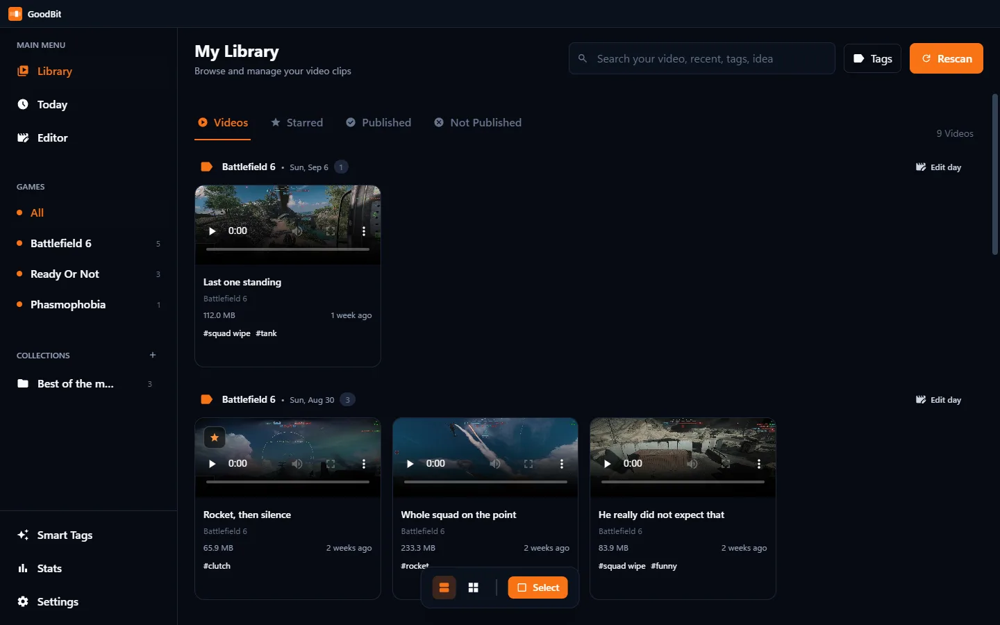

<div align="center">


# GoodBit

**You pressed the hotkey for a reason.**

**GoodBit is a companion to OBS.** OBS keeps the last thirty seconds of your game in memory and
writes them to a file when you press a key. GoodBit is what happens next: it watches that folder,
indexes every clip as it arrives, listens for which few seconds were the reason you reached for the
key, and in a game it has been taught, reads what the game itself put on screen. Then it gives you
somewhere to tag, trim and cut them together.

It does not record anything itself, and it does not replace OBS. **It can set OBS up for you**,
including the part OBS cannot do on its own: a folder per game. GoodBit's whole library is
`<folder>/<Game name>/clip.mp4`, and OBS's filename format has no token for the game you are
playing, so *Settings → Recording* offers to install OBS if it is missing, turn on the replay
buffer, bind a key, and add the script that sorts each clip into a folder named after what you were
playing. It writes into a profile of its own, leaves yours alone, and shows every line it would
write first.

Everything happens on your own machine. Nothing is uploaded unless you ask it to be.

[](https://github.com/DarrellVS/goodbit/releases/latest)
[](https://github.com/DarrellVS/goodbit/actions/workflows/ci.yml)
[](https://github.com/DarrellVS/goodbit/releases/latest)

**[Download](https://github.com/DarrellVS/goodbit/releases/latest) · [Website](https://darrellvs.github.io/goodbit/) · [Documentation](https://darrellvs.github.io/goodbit/docs.html)**



</div>

---

## What it does

- **Watches, so you do not have to.** Registered to start with Windows and living in the tray, it
  notices a clip the moment OBS finishes writing it, thumbnail, frame strip and all, whether or not
  a window is open.
- **Finds the good bit.** One cheap pass over a clip's sound (about 100 ms) says where the gunfire,
  the explosion or the shouting was, measured against that clip's own normal, and leaning towards
  the end because a replay buffer is saved *after* something happens. It stays quiet when a clip has
  nothing that stands out, which is about five clips in six, being loud is not enough, or every
  menu screen with music over it would qualify.
- **Reads the game's own HUD, where it can.** Loudness can only report that a clip got loud.
  Battlefield 6 puts a banner under the crosshair when *you* get a kill, and GoodBit looks for it,
  so the suggestion arrives with a reason attached: *you dropped someone here*, or *two kills, five
  seconds apart*, and the window is built around the kill rather than the loudest second. Only games
  that have a module for them are looked at, only when you open the Trim page, and the answer is
  cached. Nothing decodes video while you are playing.
- **Keeps your files alone.** Clips are never renamed, a display name is a database field. Deletes
  go to the Recycle Bin, never `unlink`. Trimming copies the streams rather than re-encoding, so the
  picture is the recorded bytes; a switch in Settings re-encodes it to about a fifth of the size if
  you would rather have room on the disk. What gets *published* is shrunk by default instead, since
  that is a copy and the file you keep is untouched either way.
- **Cuts a montage.** A timeline with a music lane, undo, snapping and drafts that survive a restart.
  A day of one game goes onto it in one click, in recording order, and **Trim to highlights** puts
  every clip on the moment its sound spiked.
- **Hands a clip to your phone.** No cable and no upload: the clip is served to whoever is on the
  same wifi, behind a 32-character random address, from a server that closes itself after half an
  hour. Point a camera at the code.
- **Exports properly.** Hardware encoding where the machine has it, HDR tone mapped to SDR, crop to
  widescreen, vertical or square without ever scaling up, and an optional −14 LUFS pass so a clip
  does not arrive twice as loud as the last one.
- **Publishes, if you want it to.** An optional module you run on a server of your own turns a clip
  into a public link with a Discord-friendly embed. Leave it unconfigured and the feature is simply
  absent, and if you do want it, there is a
  [guide that walks you through it](https://darrellvs.github.io/goodbit/publisher.html), with a
  quick start for anyone who already runs things behind a reverse proxy.
- **Keeps a copy of itself.** Before a new version is allowed near the database, SQLite is asked for
  a snapshot and the snapshot is read back, integrity check and row count, so an update that goes
  wrong is an inconvenience rather than a loss. Settings → Advanced lists them.
- **Learns from what you keep.** Every trim records where you cut next to what was suggested, and a
  *Wrong* button on the banner records the one thing it cannot infer. Once there are enough, the app
  fits a small readable model to your decisions by itself, uses it instead of the built-in
  threshold, and keeps refitting as you go. Settings shows how it is doing and can put the rule
  back. Nothing leaves the machine.

## Install

Grab the installer or the portable build from the
[latest release](https://github.com/DarrellVS/goodbit/releases/latest). Windows 10 or 11, 64-bit.
The installer keeps itself up to date.

**Windows will warn about an unknown publisher.** The builds are not signed with a paid certificate,
so SmartScreen shows "Windows protected your PC" on first run, *More info* → *Run anyway*. Nothing
about the warning is specific to this app; it is what an unsigned installer always does.

## First run

Point it at the folder OBS records into. The layout it expects is the one OBS already produces:

```
<your clips folder>/
  Battlefield 6/
    Battlefield 6_17.05.2026_21-09-49.mp4
  cs2/
    cs2_02.07.2026_21-41-26.mp4
```

The top-level folder name is the game name. Renaming a game in the app only changes how it is
displayed. The folder is left alone, so OBS keeps writing exactly where it was.

## The publisher (optional)

A small Express service that hosts `/media/*` and an embed page per clip. Run it wherever you like,
it is packaged for Docker and runs happily on a NAS. Put its address into Settings → App and the
publish actions appear.

Without it, everything else works; you just have no public links.

## Building from source

Node 22 and npm.

```bash
npm install
npm run dev                # electron-vite with hot reload
npm run typecheck          # main, preload and renderer
npm run test:e2e           # builds, then drives the real app with Playwright
npm run build:win          # installer + portable build in release/
```

`build:win` depends on the end-to-end suite, so an installer cannot be produced from a tree whose
tests fail. Those tests never run in CI. They need a desktop session, a GPU and ffmpeg, and each
one gets a throw-away data folder, videos root and database, so a run can never touch a real library.

## How it is put together

| | |
|---|---|
| `src/main` | The background service. Database, folder watcher, ffmpeg, the tray, everything stateful |
| `src/preload` | The only bridge the window gets |
| `src/renderer` | The Vue app |
| `src/shared` | DTOs and constants both sides agree on |
| `publisher/` | The optional public-links module |

Data calls travel over IPC to a loopback listener in the same process, behind a secret regenerated
at every launch; media is served off disk by a `goodbit://` protocol handler with Range support, so
video can seek. Nothing is reachable from outside the machine, with one deliberate exception, which
is "Send to my phone": that starts a server bound to the network which serves exactly one file,
behind a random address, and closes itself after thirty minutes or when the app quits.

More in [ELECTRON_MIGRATION.md](ELECTRON_MIGRATION.md), which describes how this grew out of a
self-hosted web app and what was deliberately thrown away on the way.

## Licence

Not yet chosen, which legally means all rights reserved. If you want to do something with this, open
an issue and ask.
